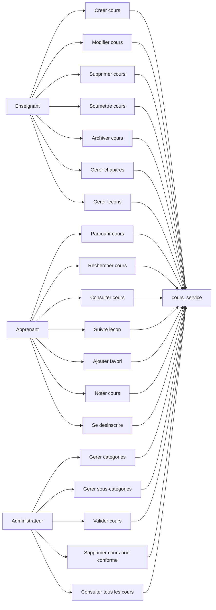
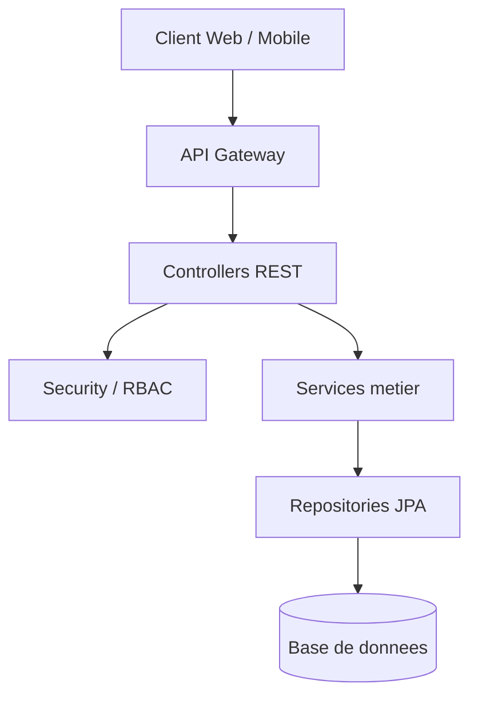
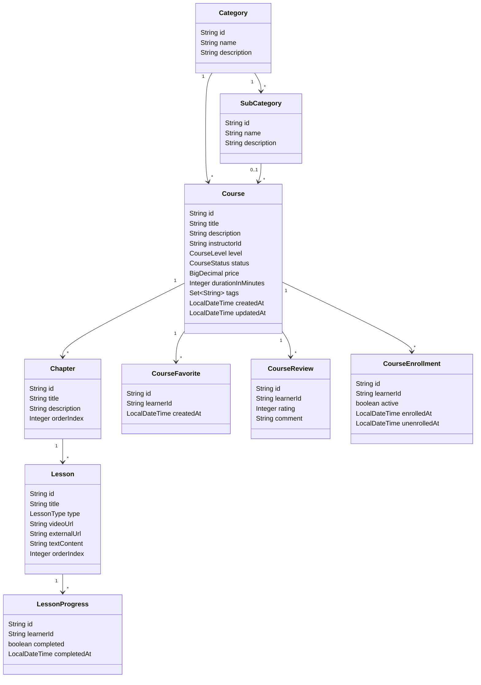
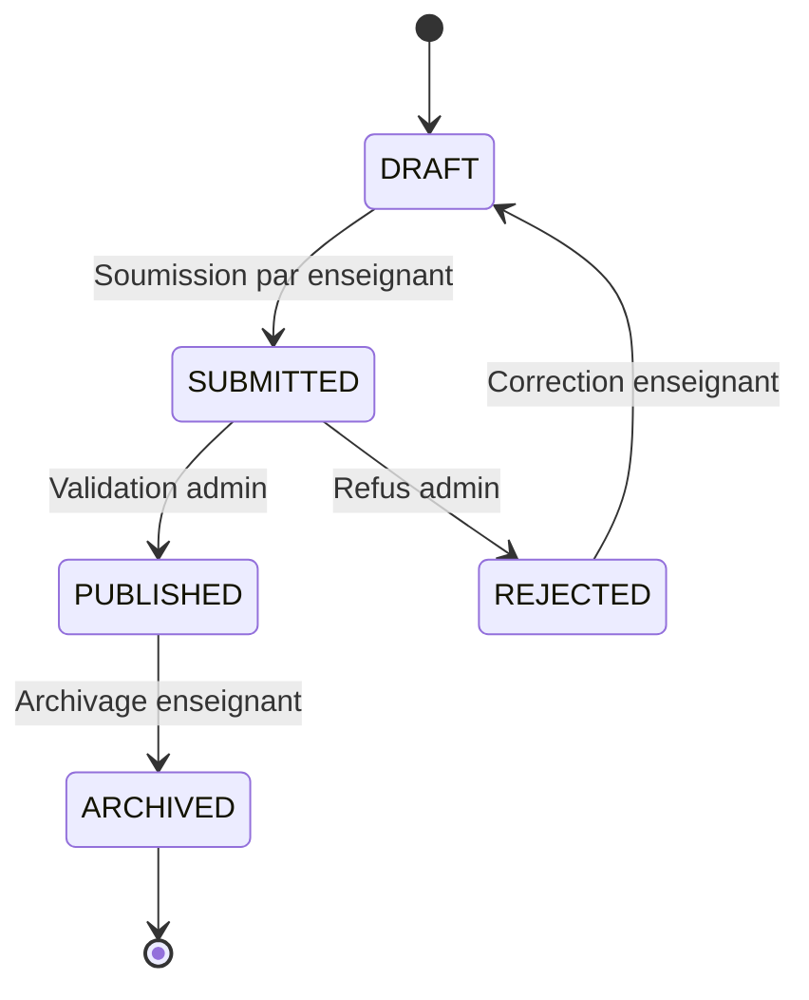
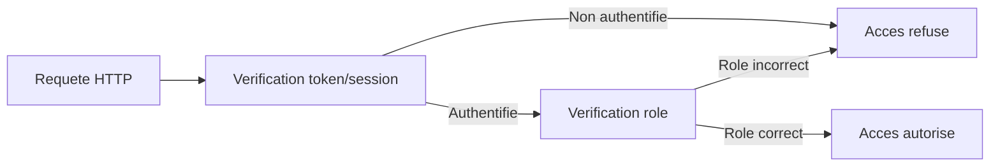
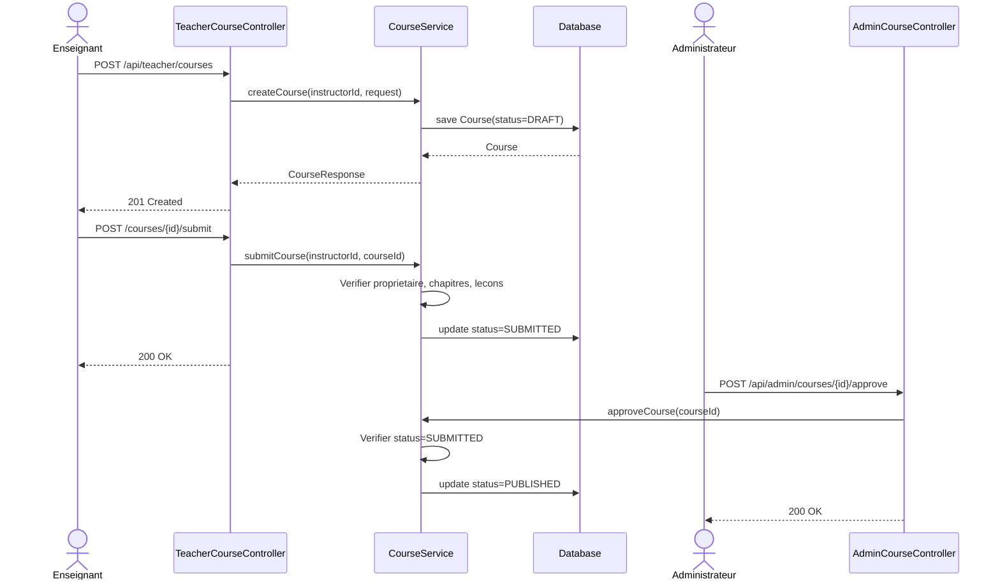
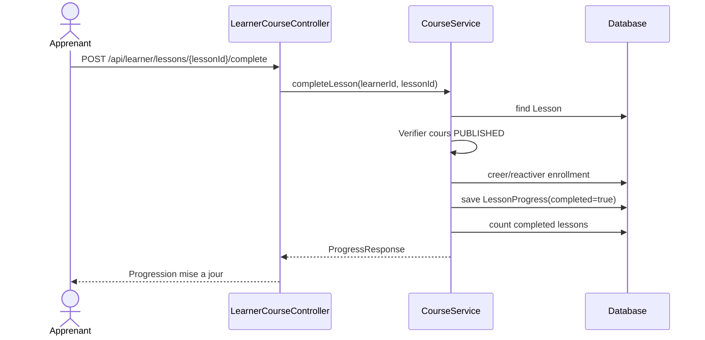
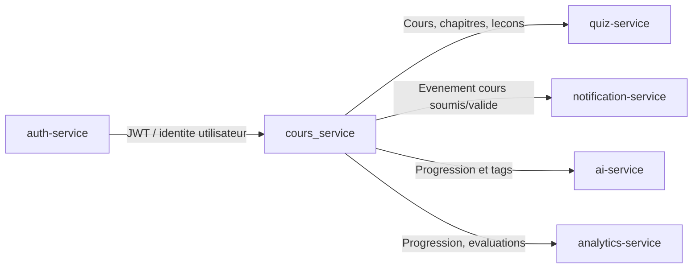

# Document de conception - cours_service

## 1. Objectif du service

Le `cours_service` est le microservice responsable de la gestion du catalogue de cours dans la plateforme d'E-learning adaptive et collaborative.

Il gere:

- la creation et l'organisation des cours par les enseignants;
- la navigation, la consultation et la progression des apprenants;
- la moderation, la validation et la structuration du catalogue par les administrateurs.

Le service ne gere pas directement:

- l'authentification des utilisateurs;
- les profils utilisateurs;
- les quiz;
- les recommandations IA;
- les notifications;
- le paiement.

Ces responsabilites appartiennent a d'autres microservices.

## 2. Acteurs

### Enseignant

Responsable de la creation et de la maintenance du contenu pedagogique.

Actions principales:

- creer un cours;
- modifier un cours;
- supprimer un cours;
- categoriser un cours;
- soumettre un cours pour validation;
- archiver un cours;
- consulter ses propres cours;
- gerer les chapitres;
- gerer les lecons;
- ajouter du contenu video, textuel ou externe;
- reorganiser les lecons.

### Apprenant

Consommateur du contenu pedagogique.

Actions principales:

- parcourir les cours;
- naviguer par categories;
- rechercher par mots-cles;
- rechercher par tags;
- consulter un cours;
- consulter le plan du cours;
- suivre une lecon;
- marquer une lecon comme terminee;
- ajouter un cours aux favoris;
- noter un cours;
- se desinscrire d'un cours.

### Administrateur

Responsable de la moderation et de la structuration du catalogue.

Actions principales:

- gerer les categories;
- gerer les sous-categories;
- valider un cours soumis;
- supprimer un cours non conforme;
- chercher et consulter tous les cours.

## 3. Cas d'utilisation



## 4. Architecture logique

Le service suit une architecture en couches.



### Responsabilites des couches

| Couche | Responsabilite |
|---|---|
| Controller | Exposer les endpoints REST et valider les DTOs |
| Security | Verifier l'identite et le role de l'utilisateur |
| Service | Porter la logique metier et les regles fonctionnelles |
| Repository | Acceder aux donnees via Spring Data JPA |
| Entity | Representer le modele persistant |
| DTO | Isoler l'API REST du modele interne |

## 5. Decoupage des packages

```text
com.anouar.elearning.course
├── config
├── controller
├── dto
├── entity
├── exception
├── repository
├── security
└── service
```

## 6. Modele conceptuel de donnees



## 7. Cycle de vie d'un cours



### Description des statuts

| Statut | Description |
|---|---|
| DRAFT | Cours en brouillon, visible seulement par son enseignant |
| SUBMITTED | Cours soumis a l'administration |
| PUBLISHED | Cours valide et visible publiquement |
| ARCHIVED | Cours indisponible aux nouveaux apprenants |
| REJECTED | Cours refuse par l'administration |

## 8. Regles metier

### Regles Enseignant

| Code | Regle |
|---|---|
| R-TEA-01 | Un enseignant ne peut gerer que ses propres cours |
| R-TEA-02 | Un cours cree par un enseignant commence en statut `DRAFT` |
| R-TEA-03 | Un cours ne peut etre soumis que s'il contient au moins un chapitre |
| R-TEA-04 | Un cours ne peut etre soumis que s'il contient au moins une lecon |
| R-TEA-05 | L'archivage rend le cours indisponible aux nouveaux apprenants |
| R-TEA-06 | Les lecons d'un chapitre sont ordonnees par `orderIndex` |

### Regles Apprenant

| Code | Regle |
|---|---|
| R-LEA-01 | Un apprenant ne peut consulter publiquement que les cours `PUBLISHED` |
| R-LEA-02 | Une lecon terminee cree ou met a jour une progression |
| R-LEA-03 | La progression est calculee selon le nombre de lecons terminees |
| R-LEA-04 | Un apprenant ne peut ajouter aux favoris qu'un cours publie |
| R-LEA-05 | Un apprenant ne peut noter qu'un cours publie |
| R-LEA-06 | Un seul avis est autorise par apprenant et par cours |

### Regles Administrateur

| Code | Regle |
|---|---|
| R-ADM-01 | Seul l'administrateur peut creer, modifier ou supprimer les categories |
| R-ADM-02 | Seul l'administrateur peut valider un cours soumis |
| R-ADM-03 | Seul un cours `SUBMITTED` peut devenir `PUBLISHED` |
| R-ADM-04 | L'administrateur peut supprimer un cours non conforme |
| R-ADM-05 | L'administrateur peut consulter tous les cours, quel que soit leur statut |

### Regles de contenu

| Type de lecon | Champ obligatoire |
|---|---|
| VIDEO | `videoUrl` |
| EXTERNAL_LINK | `externalUrl` |
| TEXT | `textContent` |

## 9. Controle d'acces RBAC



### Matrice d'acces

| Fonctionnalite | Public | Apprenant | Enseignant | Admin |
|---|---:|---:|---:|---:|
| Parcourir cours publies | Oui | Oui | Oui | Oui |
| Rechercher cours publies | Oui | Oui | Oui | Oui |
| Consulter plan cours publie | Oui | Oui | Oui | Oui |
| Creer cours | Non | Non | Oui | Non |
| Modifier cours | Non | Non | Oui, proprietaire | Non |
| Supprimer cours | Non | Non | Oui, proprietaire | Oui |
| Soumettre cours | Non | Non | Oui, proprietaire | Non |
| Archiver cours | Non | Non | Oui, proprietaire | Non |
| Gerer chapitres/lecons | Non | Non | Oui, proprietaire | Non |
| Marquer lecon terminee | Non | Oui | Non | Non |
| Ajouter favori | Non | Oui | Non | Non |
| Noter cours | Non | Oui | Non | Non |
| Se desinscrire | Non | Oui | Non | Non |
| Gerer categories | Non | Non | Non | Oui |
| Valider cours | Non | Non | Non | Oui |
| Consulter tous les cours | Non | Non | Non | Oui |

## 10. Diagrammes de sequence

### Creation et validation d'un cours



### Suivi d'une lecon par un apprenant



## 11. APIs principales par acteur

### Public

| Methode | Route | Description |
|---|---|---|
| GET | `/api/public/courses` | Parcourir et rechercher les cours publies |
| GET | `/api/public/courses/{courseId}` | Consulter un cours publie |
| GET | `/api/public/courses/{courseId}/outline` | Consulter le plan du cours |
| GET | `/api/public/categories` | Lister les categories |
| GET | `/api/public/sub-categories` | Lister les sous-categories |

### Enseignant

| Methode | Route | Description |
|---|---|---|
| POST | `/api/teacher/courses` | Creer un cours |
| GET | `/api/teacher/courses` | Consulter ses cours |
| PUT | `/api/teacher/courses/{courseId}` | Modifier un cours |
| DELETE | `/api/teacher/courses/{courseId}` | Supprimer un cours |
| POST | `/api/teacher/courses/{courseId}/submit` | Soumettre un cours |
| POST | `/api/teacher/courses/{courseId}/archive` | Archiver un cours |
| POST | `/api/teacher/courses/{courseId}/chapters` | Creer un chapitre |
| PUT | `/api/teacher/courses/{courseId}/chapters/{chapterId}` | Modifier un chapitre |
| DELETE | `/api/teacher/courses/{courseId}/chapters/{chapterId}` | Supprimer un chapitre |
| POST | `/api/teacher/courses/{courseId}/chapters/{chapterId}/lessons` | Creer une lecon |
| PUT | `/api/teacher/courses/{courseId}/chapters/{chapterId}/lessons/{lessonId}` | Modifier une lecon |
| DELETE | `/api/teacher/courses/{courseId}/chapters/{chapterId}/lessons/{lessonId}` | Supprimer une lecon |
| PUT | `/api/teacher/courses/{courseId}/chapters/{chapterId}/lessons/order` | Reordonner les lecons |

### Apprenant

| Methode | Route | Description |
|---|---|---|
| POST | `/api/learner/lessons/{lessonId}/complete` | Marquer une lecon comme terminee |
| POST | `/api/learner/courses/{courseId}/favorites` | Ajouter un cours aux favoris |
| POST | `/api/learner/courses/{courseId}/reviews` | Noter un cours |
| DELETE | `/api/learner/courses/{courseId}/enrollment` | Se desinscrire |

### Administrateur

| Methode | Route | Description |
|---|---|---|
| GET | `/api/admin/courses` | Chercher et lister tous les cours |
| GET | `/api/admin/courses/{courseId}` | Consulter un cours |
| POST | `/api/admin/courses/{courseId}/approve` | Valider un cours |
| DELETE | `/api/admin/courses/{courseId}` | Supprimer un cours non conforme |
| POST | `/api/admin/categories` | Ajouter une categorie |
| PUT | `/api/admin/categories/{categoryId}` | Modifier une categorie |
| DELETE | `/api/admin/categories/{categoryId}` | Supprimer une categorie |
| GET | `/api/admin/categories` | Chercher/lister les categories |
| POST | `/api/admin/sub-categories` | Ajouter une sous-categorie |
| PUT | `/api/admin/sub-categories/{subCategoryId}` | Modifier une sous-categorie |
| DELETE | `/api/admin/sub-categories/{subCategoryId}` | Supprimer une sous-categorie |
| GET | `/api/admin/sub-categories` | Chercher/lister les sous-categories |

## 12. Contrats de donnees principaux

### CourseRequest

```json
{
  "title": "Architecture Spring Boot",
  "description": "Concevoir un microservice propre",
  "categoryId": "category-id",
  "subCategoryId": "sub-category-id",
  "thumbnailUrl": "https://example.com/image.png",
  "level": "BEGINNER",
  "price": 0,
  "durationInMinutes": 90,
  "tags": ["spring", "microservice"]
}
```

### ChapterRequest

```json
{
  "title": "Introduction",
  "description": "Bases du cours",
  "orderIndex": 0
}
```

### LessonRequest

```json
{
  "title": "Lecon 1",
  "type": "TEXT",
  "textContent": "Contenu de la lecon",
  "orderIndex": 0
}
```

### ReviewRequest

```json
{
  "rating": 5,
  "comment": "Excellent cours"
}
```

## 13. Interactions avec les autres microservices



### Evenements possibles a publier plus tard

| Evenement | Quand |
|---|---|
| `CourseCreated` | Creation d'un cours |
| `CourseSubmitted` | Soumission par enseignant |
| `CoursePublished` | Validation par admin |
| `CourseArchived` | Archivage |
| `LessonCompleted` | Lecon terminee par apprenant |
| `CourseReviewed` | Avis depose ou modifie |

## 14. Hypotheses de conception

- L'identite utilisateur est fournie par l'auth-service ou l'API Gateway.
- Le `cours_service` stocke seulement les identifiants utilisateurs, pas les profils complets.
- Les fichiers videos ne sont pas stockes directement en base; le service stocke une URL.
- La navigation publique expose seulement les cours `PUBLISHED`.
- Les cours archives restent en base pour garder l'historique.
- Une suppression administrateur est possible pour les contenus non conformes.

## 15. Choix techniques

| Choix | Justification |
|---|---|
| DTO separes des entites | Eviter d'exposer le modele persistant |
| Services transactionnels | Centraliser les regles metier |
| RBAC par controllers | Clarifier les responsabilites par acteur |
| `orderIndex` | Permettre la reorganisation des chapitres et lecons |
| `CourseStatus` | Modeliser le workflow de validation |
| H2 en developpement | Faciliter les tests locaux |

## 16. Evolutions recommandees

Pour une version production:

1. Remplacer l'authentification par headers par une validation JWT reelle.
2. Remplacer H2 par PostgreSQL.
3. Ajouter Flyway ou Liquibase pour versionner le schema.
4. Ajouter OpenAPI/Swagger.
5. Ajouter des tests unitaires de services.
6. Ajouter des tests d'integration de controllers.
7. Ajouter une pagination sur la recherche de cours.
8. Ajouter un workflow de rejet avec motif admin.
9. Ajouter un stockage objet pour les videos.
10. Publier les evenements metier vers Kafka ou RabbitMQ.
