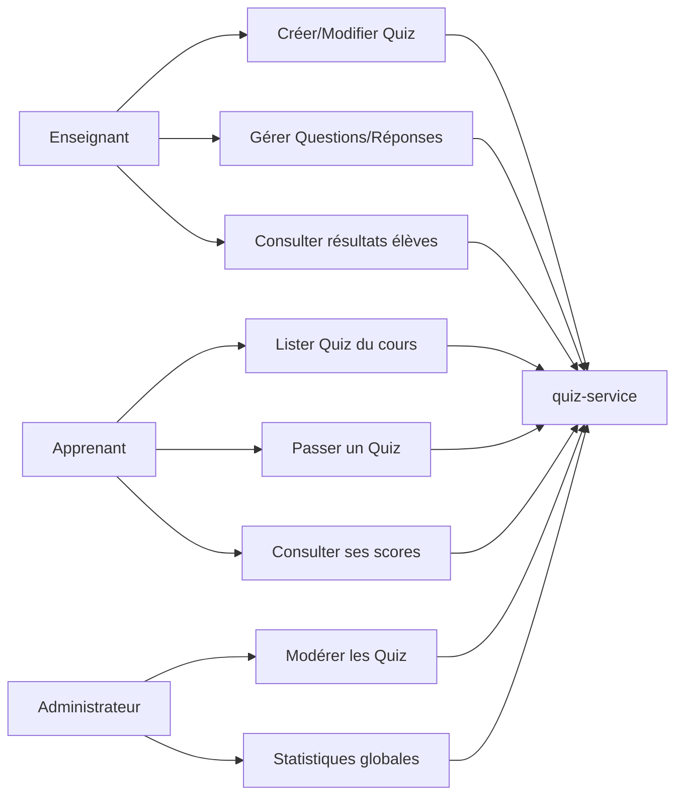
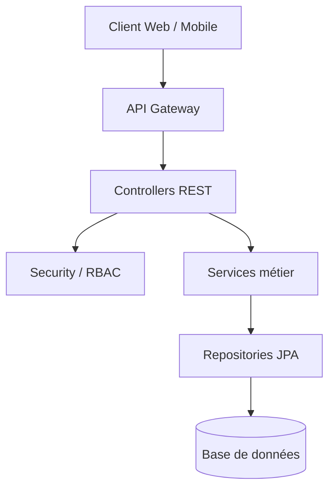
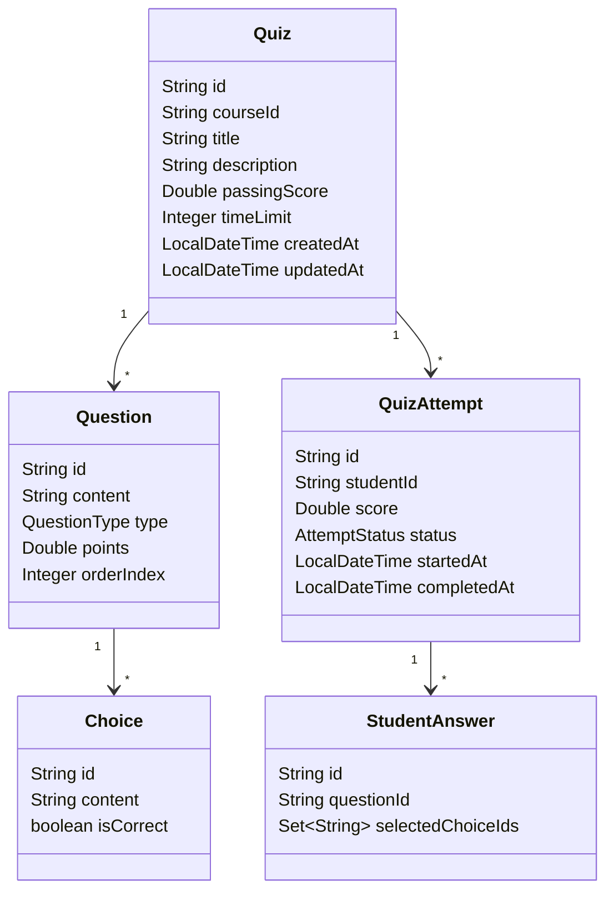
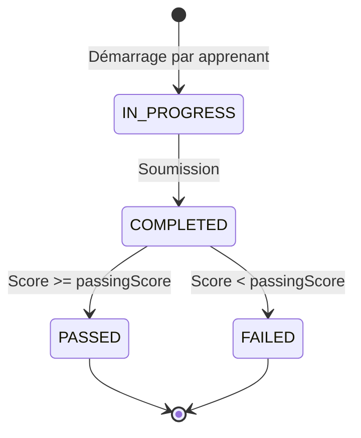
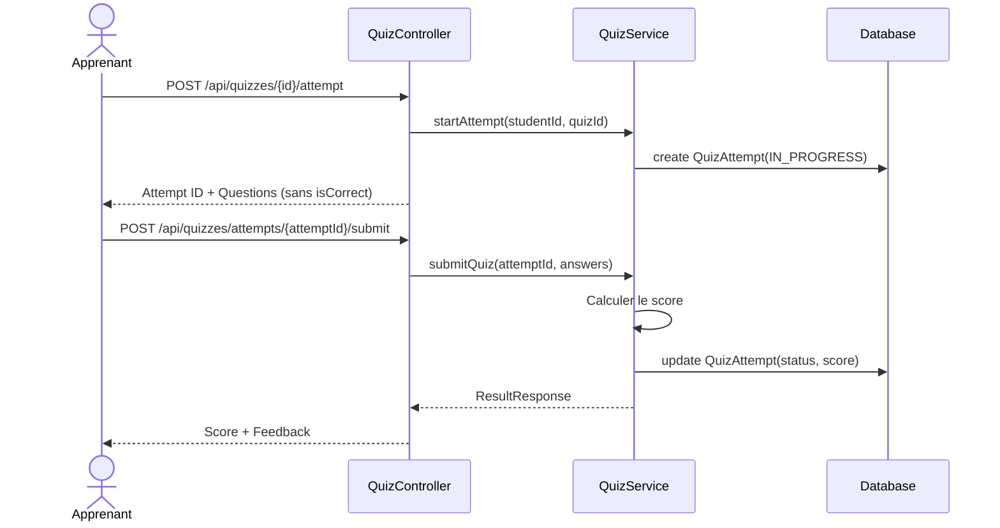
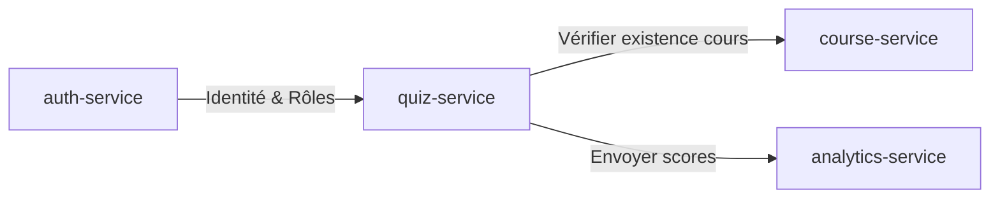

# Document de conception - quiz-service

## 1. Objectif du service

Le `quiz-service` est le microservice responsable de l'évaluation des connaissances au sein de la plateforme d'E-learning.

Il gère :
- La création et la structuration des quiz par les enseignants ;
- La passation des tests par les apprenants ;
- Le calcul automatisé des scores et des résultats ;
- Le suivi des tentatives et des performances des apprenants.

Le service dépend du `course-service` pour valider l'existence des cours auxquels les quiz sont rattachés.

## 2. Acteurs

### Enseignant
Responsable de la création de l'évaluation liée à son cours.
Actions principales :
- Créer un quiz ;
- Ajouter/Modifier/Supprimer des questions ;
- Gérer les options de réponse (choices) ;
- Définir les points par question et le score de réussite ;
- Consulter les résultats globaux des apprenants sur ses quiz.

### Apprenant
Cible de l'évaluation.
Actions principales :
- Consulter la liste des quiz d'un cours ;
- Démarrer une tentative de quiz ;
- Répondre aux questions ;
- Soumettre le quiz pour correction ;
- Consulter ses scores et l'historique de ses tentatives.

### Administrateur
Superviseur du système.
Actions principales :
- Consulter tous les quiz et tentatives du système ;
- Supprimer des évaluations non conformes.

## 3. Cas d'utilisation



## 4. Architecture logique

Le service suit une architecture en couches.



## 5. Découpage des packages

```text
com.anouar.elearning.quiz
├── config
├── controller
├── dto
├── entity
├── exception
├── repository
├── security
└── service
```

## 6. Modèle conceptuel de données



## 7. Cycle de vie d'une tentative (QuizAttempt)



## 8. Règles métier

### Règles de Conception (Enseignant)
| Code | Règle |
|---|---|
| R-QUI-01 | Un quiz doit être rattaché à un cours existant |
| R-QUI-02 | Un quiz doit comporter au moins une question |
| R-QUI-03 | Chaque question doit comporter au moins une réponse correcte |
| R-QUI-04 | Le score de réussite (`passingScore`) doit être entre 0 et 100 |

### Règles de Passation (Apprenant)
| Code | Règle |
|---|---|
| R-QUI-05 | Un apprenant ne peut voir les bonnes réponses qu'après soumission |
| R-QUI-06 | Une fois soumis, un quiz ne peut plus être modifié |
| R-QUI-07 | Le score est calculé immédiatement après la soumission |

## 9. Contrôle d'accès RBAC

### Matrice d'accès
| Fonctionnalité | Public | Apprenant | Enseignant | Admin |
|---|---:|---:|---:|---:|
| Lister quiz d'un cours | Non | Oui | Oui | Oui |
| Créer/Gérer Quiz | Non | Non | Oui (Propriétaire) | Non |
| Passer un Quiz | Non | Oui | Non | Non |
| Voir résultats détaillés | Non | Oui (Soi-même) | Oui (Ses élèves) | Oui |

## 10. Diagrammes de séquence

### Passation d'un Quiz


## 11. APIs principales par acteur

### Enseignant
| Méthode | Route | Description |
|---|---|---|
| POST | `/api/teacher/quizzes` | Créer un quiz |
| PUT | `/api/teacher/quizzes/{id}` | Modifier un quiz |
| POST | `/api/teacher/quizzes/{id}/questions` | Ajouter une question |

### Apprenant
| Methode | Route | Description |
|---|---|---|
| GET | `/api/learner/courses/{courseId}/quizzes` | Lister les quiz d'un cours |
| POST | `/api/learner/quizzes/{id}/attempt` | Démarrer un quiz |
| POST | `/api/learner/attempts/{attemptId}/submit` | Soumettre ses réponses |

## 12. Contrats de données principaux

### QuizRequest
```json
{
  "title": "Quiz Final Spring Boot",
  "courseId": "course-123",
  "passingScore": 80.0,
  "timeLimit": 20
}
```

### SubmissionRequest
```json
{
  "answers": [
    {
      "questionId": "q1",
      "selectedChoiceIds": ["c1", "c2"]
    }
  ]
}
```

## 13. Interactions avec les autres microservices


## 14. Choix techniques
- **Validation Inter-service** : Utilisation de Feign pour vérifier le `courseId`.
- **Calcul du Score** : Logique encapsulée dans le service métier pour garantir l'intégrité.
- **DTOs** : Séparation stricte entre les objets de vue (sans `isCorrect`) et les objets de gestion.
